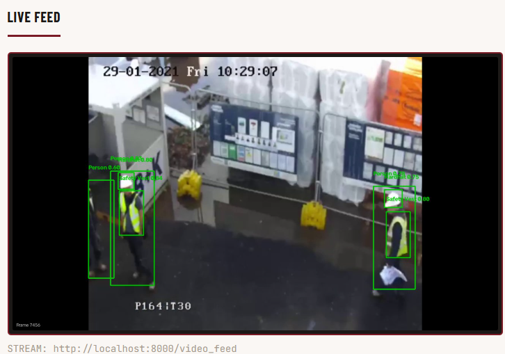
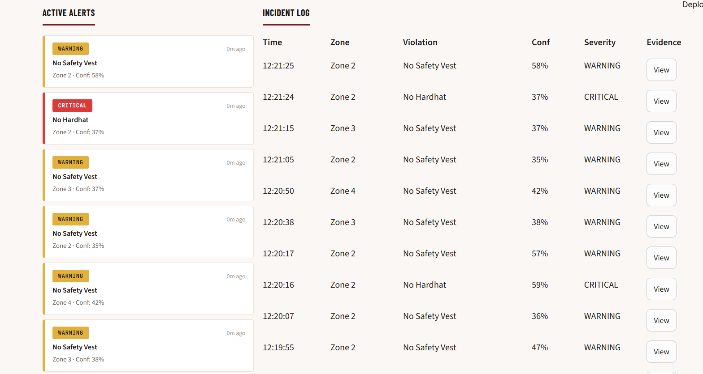
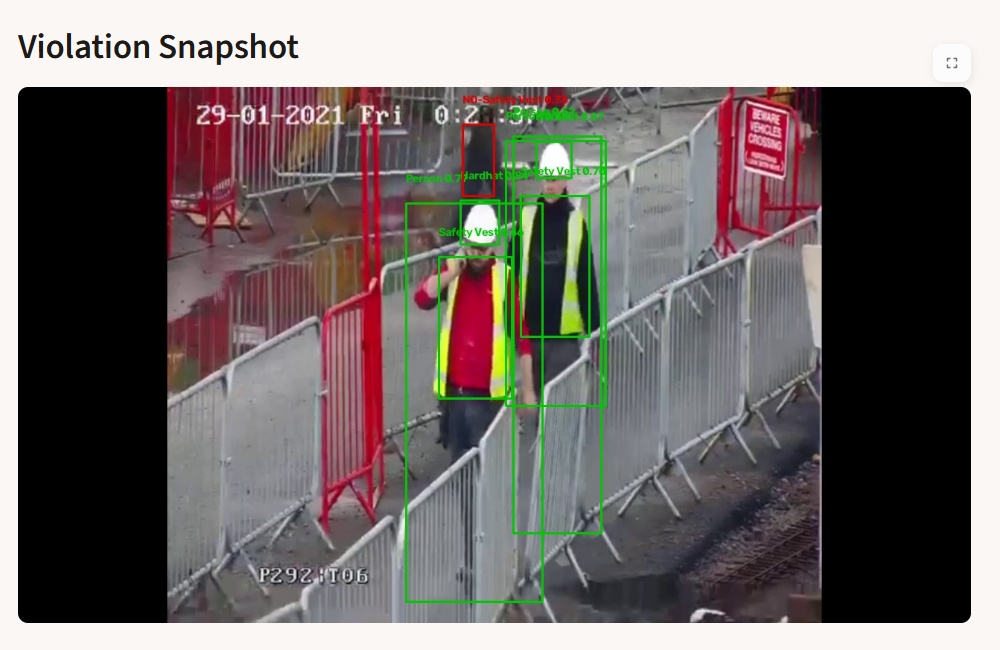
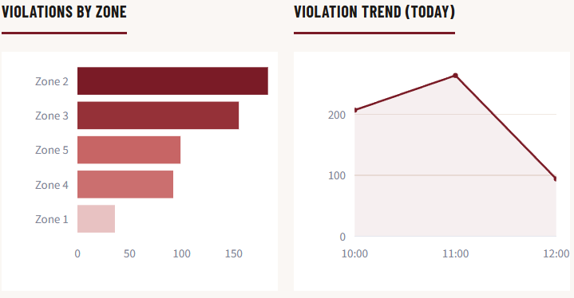
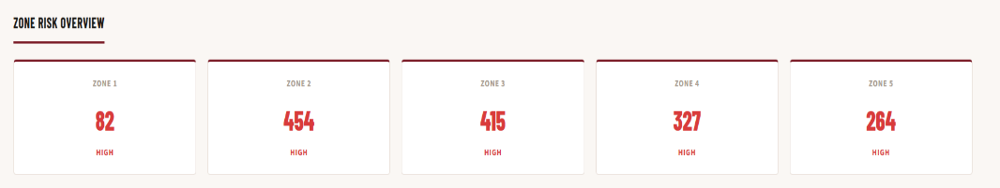
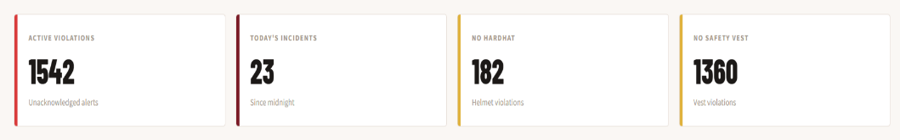

# SafeWatch

**AI-powered construction site safety monitoring system** — real-time PPE (Personal Protective Equipment) violation detection using computer vision.

Built as part of an ML internship at ONGC, Vadodara.

## Overview

Construction sites are high-risk environments where safety regulations require workers to wear PPE such as hard hats and safety vests. Manually supervising compliance across a large site is slow, error-prone, and easy to miss. SafeWatch automates this: it watches a live video feed, flags workers not wearing required PPE, logs every violation, and surfaces it all on a real-time dashboard.

## Features

- **Live detection** — real-time object detection on a video stream, with workers and PPE highlighted via bounding boxes
- **Automatic incident logging** — every violation is recorded with timestamp, zone, violation type, and confidence score
- **Violation snapshots** — a frame is automatically captured and stored as evidence whenever a violation is detected
- **Safety analytics** — zone-wise violation breakdowns, violation trends over time, and per-zone risk overview
- **Interactive dashboard** — a single-pane view of live feed, active alerts, incident log, and analytics

## Tech Stack

| Component | Technology |
|---|---|
| Object detection | YOLOv8n, fine-tuned on a Roboflow-annotated PPE dataset |
| Video processing | OpenCV |
| Backend / API | FastAPI |
| Database | SQLite |
| Dashboard | Streamlit |
| Language | Python |

## System Architecture

1. **Video input** — a live camera feed or recorded video is read frame by frame using OpenCV.
2. **Detection** — each frame is passed to the fine-tuned YOLOv8n model, which identifies workers and checks for required PPE (hard hats, safety vests), returning class, confidence score, and bounding box for each detection.
3. **Violation logic** — detections are evaluated against site rules; when a violation is found, a snapshot is captured and the event is logged.
4. **Backend (FastAPI)** — acts as the communication layer between the detection module, the SQLite database, and the dashboard, streaming results in real time.
5. **Storage (SQLite)** — stores violation records: timestamps, zones, violation type, confidence, and snapshot paths.
6. **Dashboard (Streamlit)** — pulls from the backend to display the live feed, active alerts, incident log, and analytics.

The modular design means the detection model, backend, or dashboard can each be upgraded independently without breaking the rest of the system.

## Dashboard

### Live Video Feed
Processed camera stream with YOLOv8n detections drawn in real time — workers and PPE are boxed and labeled as violations are identified.

### Active Alerts & Incident Log
Every detected violation is queued as an alert (Warning / Critical) and written to a running incident log with zone, timestamp, and confidence.

### Violation Snapshots
A frame is auto-captured for every violation, giving visual evidence for later review, auditing, or reporting.

### Safety Analytics
Zone-wise violation counts and violation trend over time, helping identify hotspots and patterns across the site.

## Challenges Faced

- **Real-time performance** — balancing detection accuracy against processing speed to keep monitoring smooth without lag.
- **Detection accuracy** — lighting, camera angle, and partial occlusion affected detection quality, requiring confidence threshold tuning.
- **Backend integration** — keeping the YOLOv8n detector, SQLite database, and Streamlit dashboard in sync so new violations show up without delay or inconsistency.

## Future Scope

- Explore transformer-based detection models as an alternative to YOLOv8n for scenarios with heavier occlusion or clutter
- Expand PPE classes beyond hard hats and safety vests (e.g. gloves, harnesses, safety boots)
- Multi-camera / multi-zone deployment with centralized monitoring

## Author

Unnabh Baruah — B.Tech, Cyber Physical Systems, Manipal Institute of Technology
[GitHub](https://github.com/big2ooth) · [LinkedIn](https://linkedin.com/in/unnabh-baruah-9b7757315)
